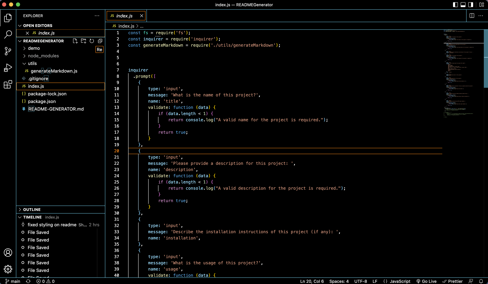

  # README GENERATOR 

  ## Description
  This application allows a user to generate a README file from user input's in Node.js using the Inquirer package.

  ## Table of Contents

  - [Description](#description)
  - [Installation](#installation)
  - [Usage](#usage)
  - [Visuals](#visuals)
  - [Tests](#tests)
  - [Contributors](#contributors)
  - [Contact](#contact)
  - [License](#license)

  ## Installation
  The application will be invoked by using the following command:

```bash
node index.js
```

  ## Usage
  This project is used to speed up the process of creating a README file for all created projects hosted on GitHub or other places.

```md
AS A developer
I WANT a README generator
SO THAT I can quickly create a professional README for a new project
```

  ## Visuals

  Please click on the screenshot below to be taken to the video demonstration of the project:

  [](https://youtu.be/iW7z--GC79I)

  ## Tests

  There are no tests for this project.

  ## Contributors

  Sherreka S. Burton

  ## Contact

  If you have any questions about this project please contact: Sherreka S. Burton

  Github: [ssbbgm](http://github.com/ssbbgm)

  Email: ssburto825@gmail.com

  ## License
  No license in place
   
